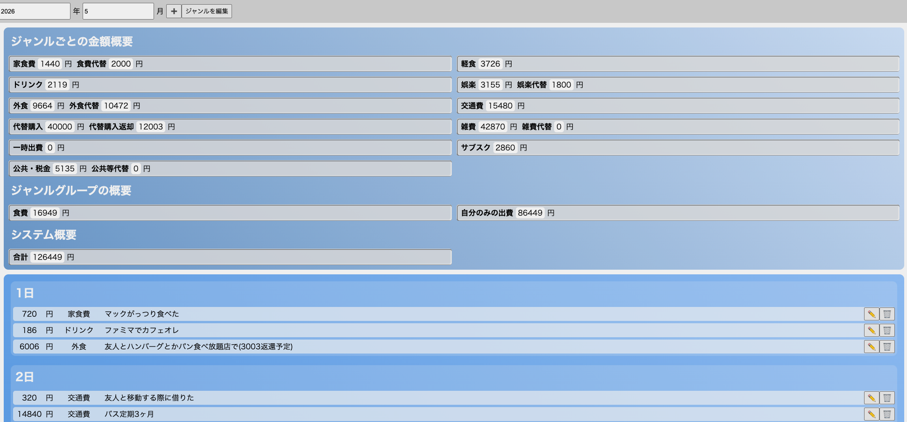

# 家計簿アプリ
「すぐに入力できる」「ジャンル毎に集計」「代替購入を明記できる」家計簿ツールです。


Excelでとりあえず金額管理をしていましたが、ふと作りたくなりました。家計簿アプリで友人の分を代替で購入したということを記す機能が他になさそうなので、自作しました。

# 実行方法
- 実行環境: Node.js
- テスト済み
    - サーバー: macOS
    - クライアント: macOS、Windows、iPad

もしNode.jsがインストール済みの場合、実行するのは次のコマンドのみです。
```sh
npm start
```
たったこれだけで`http://localhost:3000`が立ち上がります。一応リポジトリを公開するにあたって、立ち上がったことを伝える旨の「起動したよー」とだけ表示するようにしています。

# 使い方
操作方法はほとんど凝ってませんが、キーボードオンリーでできるように仕上げています。
1. Nキーを押すと日付入力を求められる。
2. Enterを押すと金額にカーソルが合うため入力
3. Tabなどを使って項目を転移(ブラウザ機能)
4. Enterを押すと確定し保存
5. 以後Nキーを押すと前回入力の日付が利用できるため、同日の場合は連打で続行可能

また、編集も可能です。鉛筆マークから編集し、普通にEnterやマウスで確定することもできます。

# このリポジトリの売り
制作開始はなんと4/21の17時からです。初回コミットは4/22ですが、まあ約半日でベースを仕上げた上に、利用が可能なレベルまで持っていった品物です。半日で仕上げるとこういうシステムになるんだよ、こういう使い心地だよ、というある種のポートフォリオです。そういう使い方をさせていただきます。

# シンプルが故の問題点
- 現在「ジャンルを編集」をGUIから実行できません。jsonを操作してジャンルを追加しました。
- 半角の「n」が入力できません。

それ以外は**全て**正常に動きます。
